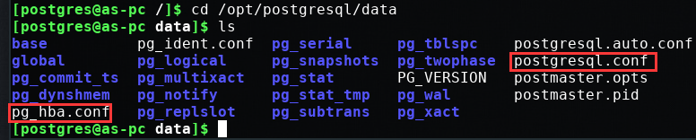
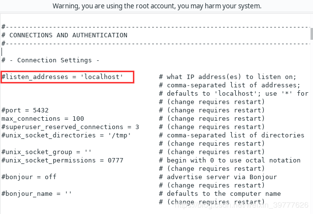
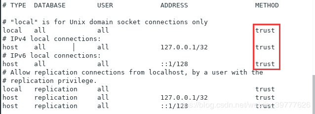

## Install postgresql database(source code)
### Download source code
[Postgresql source code Portal](https://www.postgresql.org/ftp/source/)

1.Decompression
```
tar -xvzf postgresql-**.*.tar.gz
```

2.Enter the unzipped directory
```
cd decompression path
```

3.Detecting the Target Characteristics of Installation Platform
```
./configure --prefix=/opt/postgresql
```

4.Compile
```
make
```

5.Install
```
sudo make install
```

6.Adding Users - New User Related Configuration
```
sudo useradd postgres
sudo passwd postgres  #Enter the password twice later.

cd /home

#Create the Postgres folder
sudo mkdir /home/postgres

#Setting permissions
sudo chmod 755 /home/postgres

#Initialization
sudo cp -a /etc/skel/. /home/postgres

```
7.New folder data
```
sudo mkdir /opt/postgresql/data
```

8.Setting File Owner
```
sudo chown postgres /opt/postgresql/data
```

9.Log in as postgres
```
su - postgres
```

10.Initialization
> Super user Postgres will be created automatically (users executing initdb)
```
/opt/postgresql/bin/initdb -D /opt/postgresql/data
```

11.Open service
```
/opt/postgresql/bin/pg_ctl -D /opt/postgresql/data start
```

12.Open the database
```
/opt/postgresql/bin/psql -U postgres
```

13.Configure postgres User Password
```
alter user postgres with password '***password***';

#exit 
\q
```

14.Close service
```
/opt/postgresql/bin/pg_ctl -D /opt/postgresql/data stop
```

15.Other configurations
> At this point, there are two configuration files, postgresql.conf and pg_hba.conf, in the / opt/postgresql/data directory.



15.1.1 postgresql.conf



```
#listen_addresses = 'localhost' 	#Indicates that only local connections are monitored
Modified to
listen_addresses = '*'				#Represents listening on all IP, or you can change it to the IP you need to listen on
```

15.1.2 pg_hba.conf
> Trust means no password access is allowed, which is insecure. Change it to MD5 and use password access.



## Import database
1. Open pgAdmin4 and connect to the server. Select the database to execute the file.
2. See the SQL icon in the above column, Click.
3. After opening, click Import File. Execution can.


